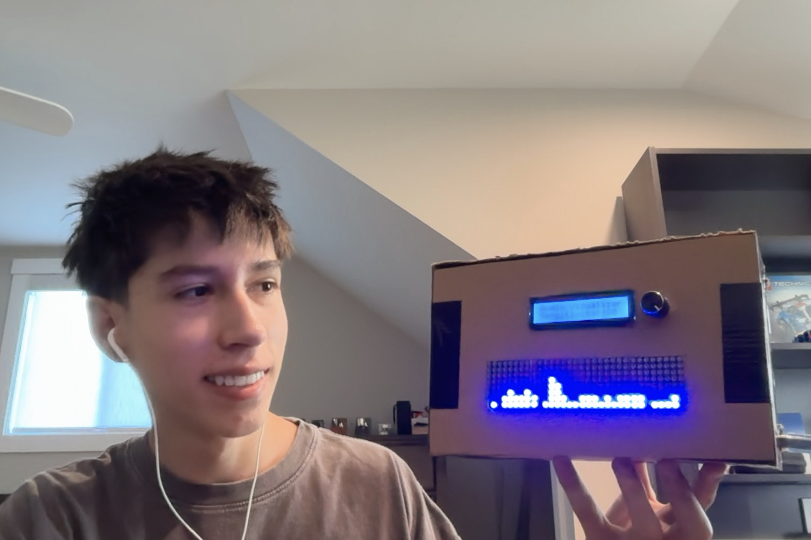
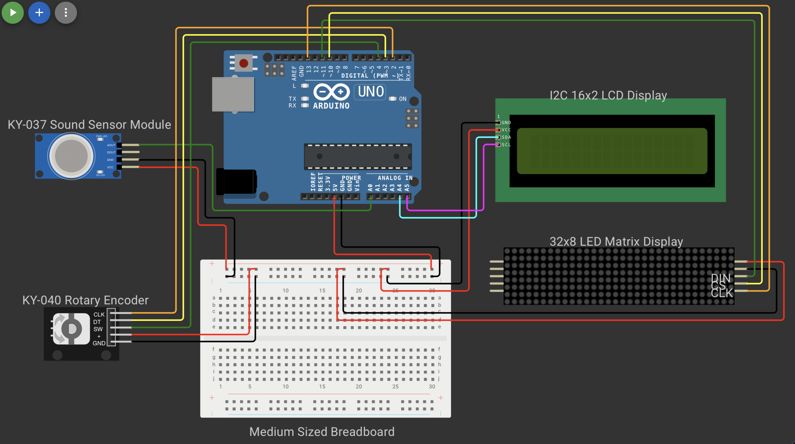

# Audio Spectrum Visualizer
This project is an Arduino powered audio visualizer that transforms live sound into moving patterns on a 32×8 LED matrix display. By combining a microphone sensor, real-time signal processing, and an animated display, it turns music and other sounds into a visual experience

| **Engineer** | **School** | **Area of Interest** | **Grade** |
|:--:|:--:|:--:|:--:|
| Adrian F | Terra Linda High School | Mechanical Engineering | Incoming Senior |

<p align="center">
  
</p>
  
# Final Milestone

**Don't forget to replace the text below with the embedding for your milestone video. Go to Youtube, click Share -> Embed, and copy and paste the code to replace what's below.**

<iframe width="560" height="315" src="https://www.youtube.com/embed/F7M7imOVGug" title="YouTube video player" frameborder="0" allow="accelerometer; autoplay; clipboard-write; encrypted-media; gyroscope; picture-in-picture; web-share" allowfullscreen></iframe>

For your final milestone, explain the outcome of your project. Key details to include are:
- What you've accomplished since your previous milestone
- What your biggest challenges and triumphs were at BSE
- A summary of key topics you learned about
- What you hope to learn in the future after everything you've learned at BSE


# First Milestone

<iframe width="560" height="315" src="https://www.youtube.com/embed/ZX0E4HqxcDc?si=fk7Na8wRHeSnDecw" title="YouTube video player" frameborder="0" allow="accelerometer; autoplay; clipboard-write; encrypted-media; gyroscope; picture-in-picture; web-share" referrerpolicy="strict-origin-when-cross-origin" allowfullscreen></iframe>


For my first milestone, I created an audio visualizer using an Arduino Uno R3, a microphone sensor, and a 32×8 LED dot matrix display. The microphone detects sound and sends an analog signal to the Arduino, which processes the audio using a Fast Fourier Transform and displays the results as moving frequency bars on the LED matrix.

So far, I have completed the wiring, tested each component, and programmed the display to react to music. One challenge has been improving the microphone’s sensitivity and making the visualizer respond accurately to quieter sounds. My next steps are to refine the code, improve the audio input, organize the wiring, and build an enclosure for the finished project. In order to organize the wiring and improve the audio input, I plan on adding a case and an upgraded sound sensor.

# Schematic 

<p align="center">
  
</p>

# Code

```c++
#include <arduinoFFT.h>
#include <MD_MAX72xx.h>
#include <SPI.h>
#include <Encoder.h>
#include <Wire.h>
#include <hd44780.h>
#include <hd44780ioClass/hd44780_I2Cexp.h>

const uint8_t CS_PIN = 10;
const uint8_t MAX_DEVICES = 4;
const uint8_t SOUND_PIN = A0;
const uint8_t ENC_SW = 4;

const uint16_t SAMPLES = 64;
const double SAMPLING_FREQUENCY = 4000.0;
const unsigned long SAMPLING_PERIOD_US = 250;

MD_MAX72XX disp(MD_MAX72XX::FC16_HW, CS_PIN, MAX_DEVICES);
Encoder knob(2, 3);
hd44780_I2Cexp lcd;

int magnitudeMax = 520;
long previousEncoderPosition = 0;

double realComponent[SAMPLES];
double imagComponent[SAMPLES];

ArduinoFFT<double> FFT(
  realComponent,
  imagComponent,
  SAMPLES,
  SAMPLING_FREQUENCY
);

const uint8_t spectralHeight[9] = {
  0b00000000,
  0b10000000,
  0b11000000,
  0b11100000,
  0b11110000,
  0b11111000,
  0b11111100,
  0b11111110,
  0b11111111
};

void updateLCD() {
  lcd.setCursor(0, 1);
  lcd.print("Sensitivity:    ");
  lcd.setCursor(12, 1);
  lcd.print(magnitudeMax);
}

void setup() {
  Serial.begin(9600);
  pinMode(ENC_SW, INPUT_PULLUP);

  disp.begin();
  disp.control(MD_MAX72XX::INTENSITY, 3);
  disp.clear();

  lcd.begin(16, 2);
  lcd.print("Audio Visualizer");
  updateLCD();
}

void loop() {
  long encoderPosition = knob.read() / 4;

  if (encoderPosition != previousEncoderPosition) {
    int change = encoderPosition - previousEncoderPosition;

    magnitudeMax += change * 20;
    magnitudeMax = constrain(magnitudeMax, 80, 1200);
    previousEncoderPosition = encoderPosition;

    updateLCD();

    Serial.print("Sensitivity: ");
    Serial.println(magnitudeMax);
  }

  if (digitalRead(ENC_SW) == LOW) {
    magnitudeMax = 520;
    knob.write(0);
    previousEncoderPosition = 0;
    updateLCD();
    delay(150);
  }

  for (uint16_t i = 0; i < SAMPLES; i++) {
    unsigned long sampleStart = micros();

    realComponent[i] = analogRead(SOUND_PIN);
    imagComponent[i] = 0;

    while (micros() - sampleStart < SAMPLING_PERIOD_US) {
    }
  }

  FFT.dcRemoval();
  FFT.windowing(FFTWindow::Hamming, FFTDirection::Forward);
  FFT.compute(FFTDirection::Forward);
  FFT.complexToMagnitude();

  for (uint8_t i = 0; i < 32; i++) {
    uint8_t level = 0;

    if (i > 0) {
      int magnitude = constrain(
        (int)realComponent[i],
        0,
        magnitudeMax
      );

      level = map(magnitude, 0, magnitudeMax, 0, 8);
    }

    disp.setColumn(31 - i, spectralHeight[level]);
  }
}
```


# Materials

| **Part** | **Note** | **Price** | **Link** |
|:--:|:--:|:--:|:--:|
| Arduino Uno R3 | Processes the microphone signal and controls the display | $9.98 | [Link](https://www.amazon.com/dp/B0FKN4T68T) |
| KY-037 Sound Sensor Module | Can capture and transmit analog audio signals to the Arduino | $6.59 for 4 | [Link](https://www.amazon.com/dp/B0DNDV4M57) |
| 32x8 LED Dot Matrix Display | Displays the audio spectrum as LED bars | $8.99 | [Link](https://www.amazon.com/dp/B07W1WCXXS) |
| Case for Audio Visualizer | Case to hold all components together (Not used, instead I made a cardboard box) | Needs to be 3d printed | [Link](https://www.thingiverse.com/thing:4976485) |
| KY-040 Rotary Encoder | Used as a threshold for microphone sensitivity | $8.99 for 2 | [Link](https://www.amazon.com/dp/B07YFPV5N4) |
| I2C 1602 Display Module | Used to display value that is changed by the Rotary Encoder | $9.99 for 2 | [Link](https://www.amazon.com//dp/B07S7PJYM6) |
| Wires | Used to connect components | $5.99 for 120 | [Link](https://www.amazon.com/dp/B0B2L66ZFM) |
| Breadboard | Used for power rails, 5v rail and ground rail | $6.48 for 2 medium and 2 full | [link](https://www.amazon.com/dp/B07DL13RZH) |


# Resources

- [Resource 1](https://circuitdigest.com/microcontroller-projects/diy-music-audio-visualizer-using-dot-matrix-display-and-arduino-nano)
- [Resource 2](https://www.youtube.com/watch?v=pHw3AokxRXM)
- [Resource 3](https://wokwi.com)
